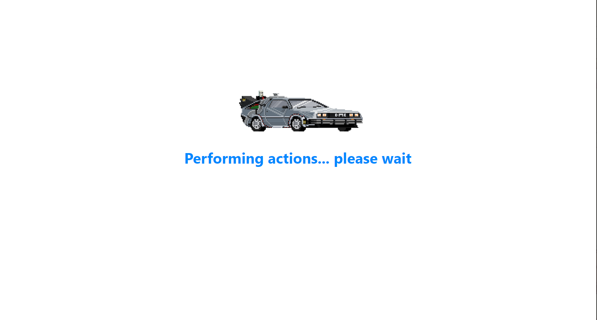

# Individual Project - Henry Videogames App

  SPA (Single Page Application) Web donde encuentras una gran variedad de juegos y sus características utilizando una API como base de información.

Landing Page

  

Home 

  

Paginado

  

Videogame Details

  

Create a Videogame

  

Loading

  

Objetivos del Proyecto

- Construir una App utlizando React, Redux, Node y Sequelize.
- Afirmar y conectar los conceptos aprendidos en la carrera.
- Aprender mejores prácticas.
- Aprender y practicar el workflow de GIT.
- Usar y practicar testing.

